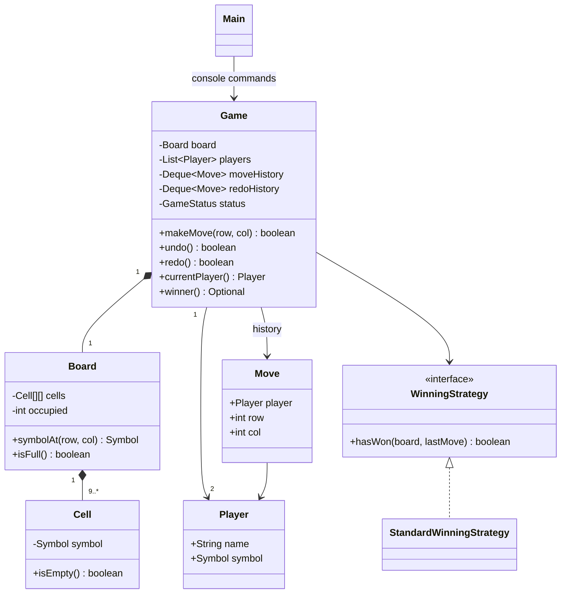
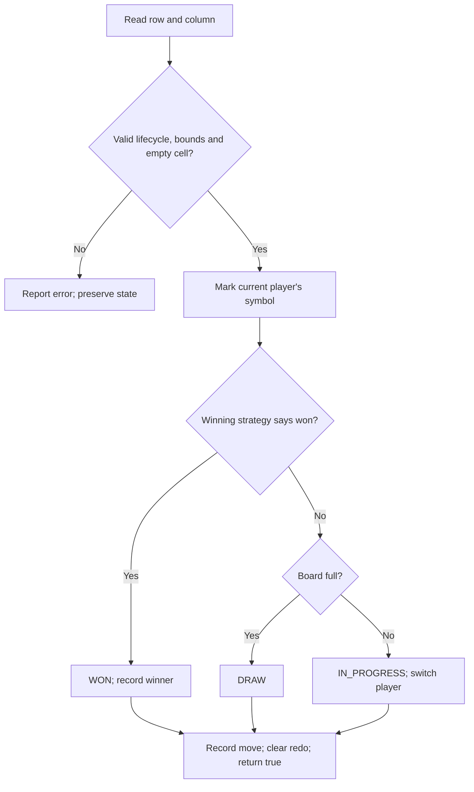

# Tic-Tac-Toe — Java LLD

## 1. Requirements

- Two players with distinct X/O symbols; first player starts and turns alternate.
- Default console game: 3 x 3 board. Domain supports N x N, N >= 3.
- A complete row, column, or main diagonal wins. This is N-in-a-row, not arbitrary K-in-a-row.
- Reject out-of-range coordinates, occupied cells, and moves after a win/draw.
- A full board without a winner is a draw; win evaluation takes precedence.
- Undo and redo individual moves, including moves that finish the game.
- A successful move returns `true`, meaning **applied successfully**, not **won**.
  Validation failures throw an exception; consult `status()` and `winner()` for the outcome.
- Console accepts zero-based `row col`, `undo`, `redo`, and `quit`.
- Persistence, bots, networking, and concurrent access are outside this implementation.

## 2. Entities and responsibilities

| Entity | Responsibility |
| --- | --- |
| Game | Own board mutations, validate game lifecycle, manage turns/status/winner and two history stacks |
| Board | Own cells, enforce bounds/occupancy and maintain occupied count |
| Cell | Store an empty or marked symbol |
| Player | Immutable player name and symbol |
| Move | Immutable player and coordinate data for history/replay |
| Symbol / GameStatus | Explicit symbol and lifecycle values |
| WinningStrategy | Contract for deciding whether the last move wins |
| StandardWinningStrategy | Check row, column, and main diagonals |
| Main | Read console input, display state, report errors |

## 3. Architecture / class diagram



The console depends on Game; Game coordinates the board and an injected strategy.
Board mutation methods are package-private. Game exposes symbols and immutable
history copies instead of handing callers a mutable board. Keep domain clients
outside the `tictactoe` package to respect this boundary.

## 4. End-to-end move flow

1. Main reads `row col` and parses both integers.
2. Game rejects a terminal game, invalid coordinates, or an occupied cell.
3. Game creates a Move using the current player; callers cannot submit an out-of-turn player.
4. Board marks the cell and increments its occupied count.
5. WinningStrategy examines the resulting board. If the strategy throws, Game clears
   the cell and preserves the prior turn, status, and histories.
6. Game appends the accepted move to move history.
7. If won: set WON and winner. Otherwise, if full: set DRAW. Otherwise remain IN_PROGRESS.
8. Advance the turn only for IN_PROGRESS. In a terminal state currentPlayer is the last mover.
9. Clear redo history because this accepted move creates a new timeline; return true.
10. Main renders the updated board and outcome. Rejected input reports an error and retries.



Example: `0 0`, `1 0`, `0 1`, `1 1`, `0 2` gives X the top row.
Every call returns true, while only the final move changes status to WON.

## 5. Design decisions and trade-offs

- **Game is the coordinator:** Cell/Board enforce storage invariants while Game enforces
  lifecycle and turns. Putting every rule in Main would couple rules to console input.
- **Inject the winning policy:** Swap the strategy without rewriting Game. Policies
  must be deterministic, side-effect-free, and depend on the board/last move. A stateful
  strategy would require additional undo hooks or stored strategy snapshots.
- **Check lines in O(N):** Standard strategy scans four lines. A move costs O(N),
  undo O(1), and redo O(N). Counter-based checks could be O(1) but require synchronized
  counter changes during undo/redo. Simpler scanning is easier to explain and audit.
- **Board/history memory:** O(N²) cells plus O(M) history, with M <= N² accepted moves
  across current move and redo stacks. Creating a history snapshot costs O(M).
- **Two stacks:** ArrayDeque uses its tail as the stack top. This is efficient for
  linear local history; arbitrary historical branching would need a tree or event log.
- **Exceptions for invalid moves:** Error messages explain rejection; true signals
  successful application. A typed MoveResult would help a richer UI or API.
- **Single-threaded:** No locking. A multiplayer server should serialize commands per game.
- **Records:** Player and Move are immutable values using Java 17-compatible syntax.
  Cell is explicit for LLD discussion; a Symbol matrix would be simpler for this small game.

## 6. Patterns used

- **Strategy:** WinningStrategy and StandardWinningStrategy separate the win policy.
- **Command-style history:** Move stores enough data to apply/reverse one action. This
  is not a full Command pattern: execute/undo behavior lives in Game rather than in Move.
- **Dependency injection:** The constructor receives the winning strategy.

No Singleton, Factory, or Observer is needed for the current requirements.

## 7. Undo / redo notes

- Undo pops the newest applied move, clears its cell, pushes it to redo, restores
  that player's turn, clears winner, and sets IN_PROGRESS.
- This works for terminal moves because the preceding position was nonterminal;
  ordinary play cannot continue after a terminal state.
- Redo peeks at the newest undone move, applies it through the same outcome calculation,
  then removes it from redo. It preserves other redo entries.
- Undo A then B means redo B then A. Multiple undo/redo operations preserve chronology.
- A valid new move after undo clears redo. An invalid attempt leaves redo intact.
- Empty undo/redo returns false. Undo can reopen a win/draw; redo can restore it.
- This implementation does not let the user change the winning strategy mid-game.

## 8. Run and verify

From this problem folder, using JDK 17+ in PowerShell:

```powershell
./run.ps1 -TestOnly
./run.ps1
```

If local PowerShell policy prevents scripts, compile and run directly:

```powershell
New-Item -ItemType Directory -Force out
$javaSources = Get-ChildItem src/main/java,src/test/java -Recurse -Filter *.java | ForEach-Object FullName
javac --release 17 -d out $javaSources
java -cp out tictactoe.GameTest
java -cp out tictactoe.Main
```

Checks cover validation/state preservation, both players winning, all line directions,
draws, larger boards, undo/redo including terminal states and complete histories,
branching, invalid configuration, and strategy failure rollback. Tests throw explicit
AssertionError, so they do not depend on enabling JVM assertions.

## 9. Possible extensions

- K-in-a-row policy: inspect contiguous segments through the last move.
- Bot player: separate move selection from Game's application/validation.
- GUI or HTTP adapter: retain Game and replace Main.
- Save/load: serialize configuration and move events, replay with validation.
- Multiplayer: authenticate player identity and serialize per-game commands.
- MoveResult: typed validation reason, accepted move, and resulting outcome.
- Scoreboard and rounds: put match orchestration above Game.

## 10. Concise interview revision notes

1. Clarify board size, win rule, players, invalid inputs, and undo scope first.
2. Identify Game, Board, Cell, Player, Move, and WinningStrategy.
3. Game owns turns/lifecycle; Board owns storage; strategy owns win detection.
4. Explain validate → mark → evaluate win → evaluate draw → advance → record history.
5. `true` means move accepted; WON is a separate state.
6. Explain both history stacks and why a new move invalidates redo.
7. State O(N) move checks, O(1) undo, and O(N²) board memory.
8. Discuss counters only when performance requirements justify their undo complexity.
9. Call out single-threaded access and pure strategies as explicit assumptions.
10. Walk through a win, rejected move, undo of the win, and redo before adding features.
