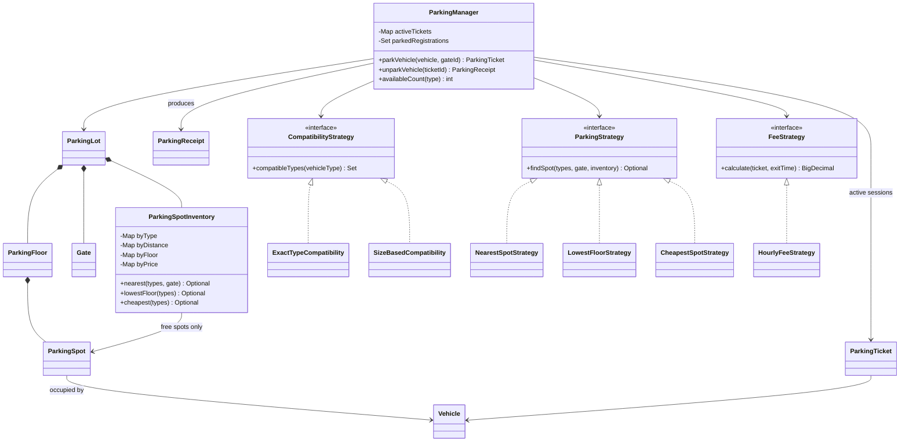
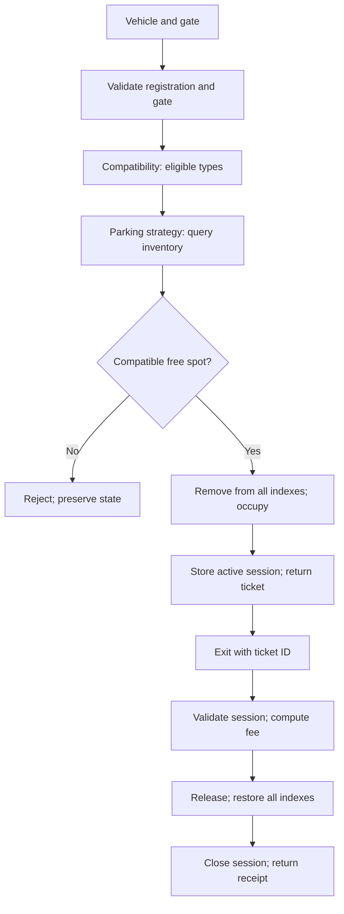

# Parking Lot — Java LLD

## 1. Requirements and scope

- Multiple floors, each containing BIKE, CAR, or TRUCK spots; one vehicle per spot.
- Entry accepts a vehicle and registered gate ID, selects an available compatible
  spot, and issues a ticket. Exit accepts an active ticket ID, calculates a fee,
  releases the spot, and returns a receipt.
- Reject duplicate registration, unknown gate/ticket, repeated exit, and lack of capacity.
- Separate **compatibility** (eligible spot types), **parking** (which eligible spot),
  and **fee** (how much to charge) policies.
- Lot owns the available inventory, including type, distance per gate, floor, and price indexes.
- Runnable demo uses one entry gate. The same implementation supports several gates;
  distance is a simplified Manhattan distance in a shared coordinate system. It does
  not model floor travel, ramps, or actual driving routes.
- Default compatibility is exact type. Optional size-based compatibility lets bikes
  use any type, cars use CAR/TRUCK, and trucks use TRUCK.
- Default fee is the spot's hourly rate times started hours, minimum one hour.
  Zero-duration parking also costs one hour; 60 minutes costs one, 60 minutes plus
  one nanosecond costs two. Demo rates are INR; all spots must use one currency.
- Fees and allocation rules are explicit example policies; change them to match requirements.
- No payment gateway, reservations, persistence, lost-ticket handling, or gate hardware.

## 2. Entities and responsibilities

| Entity | Responsibility |
| --- | --- |
| ParkingManager | Orchestrate entry/exit, active tickets, duplicate vehicle checks, serialized mutations |
| ParkingLot | Own floors, registered gates, and available inventory |
| ParkingFloor | Immutable floor container; validate spot floor membership |
| ParkingSpot | Immutable identity/type/location/rate plus current occupancy |
| Vehicle | Immutable normalized registration and vehicle type |
| Gate | Immutable gate identity and coordinates |
| ParkingSpotInventory | Maintain only available spots in every ordering |
| CompatibilityStrategy | Return eligible spot types |
| ParkingStrategy | Select a spot among compatible candidates using inventory queries |
| FeeStrategy | Calculate amount from ticket and exit time |
| ParkingTicket | Immutable entry snapshot: vehicle, spot, gate, time, hourly rate |
| ParkingReceipt | Immutable exit time and final amount; not proof of payment |

## 3. Architecture / class diagram



## 4. End-to-end entry and exit flow

**Entry:**

1. Client calls `ParkingManager.parkVehicle(vehicle, gateId)`.
2. Manager validates the gate and rejects an already parked registration.
3. CompatibilityStrategy identifies eligible spot types.
4. ParkingStrategy queries the inventory's ordering. Nearest compares the nearest
   candidate from each eligible type; it can choose a CAR spot over a farther BIKE
   spot under size-based compatibility.
5. Manager verifies the selected object is available, belongs to this inventory,
   and has an eligible type. No candidate means entry is rejected without mutation.
6. Generate UUID ticket and snapshot time/rate before changing occupancy.
7. Remove the selected spot from **every** index, mark it occupied, and store the
   active ticket and normalized registration. Return the ticket.

**Exit:**

1. Client supplies ticket ID; manager looks up its authoritative active session.
2. Reject unknown or closed ticket. Read injected Clock and reject exit before entry.
3. FeeStrategy calculates the fee using the ticket's captured rate. Reject negative
   fees; failures occur before releasing capacity or closing the session.
4. Release the spot, add it back to every index, remove the active ticket and
   registration, then return the receipt.
5. Vehicle may now enter again. Reusing the closed ticket is rejected.



## 5. Available inventory / index design

Each type has a TreeSet ordered by ID, floor, and rate; every gate also has a
per-type TreeSet ordered by distance. ID breaks ties in all orderings, ensuring
equal-distance or equal-price spots are not collapsed by TreeSet.

Index keys use immutable metadata. Occupancy changes never change comparator keys.
All queries compare the first candidate across eligible types. Manager owns the
single remove/add operation that updates all indexes; strategies do not pop spots.

With S spots, G gates, and K compatible types:

- Add/remove: O((G + 3) log S), touching every maintained ordering.
- Candidate query: O(K log S), because Java TreeSet.first traverses to the smallest entry.
- Type count: O(1). Active ticket lookup: expected O(1).
- Index memory: O((G + 3) S), plus O(S) active sessions at capacity.

A priority queue suits one nearest-gate ordering, but deleting a chosen spot from
other queues costs O(S) without extra machinery. TreeSet supports removal by key
in O(log S). Multiple indexes cost memory and update work; for a tiny lot a scan
would be easier. Available spots are indexed by **spot** type, not vehicle type.

## 6. Design decisions and trade-offs

- Composition `ParkingLot → ParkingFloor → ParkingSpot` reflects physical ownership.
  Construct fresh spot objects for each lot; do not share mutable spot instances across lots.
- One manager per lot is enforced. Synchronized manager operations serialize selection
  and reservation so two arrivals cannot reserve the same spot. Separate lots operate independently.
- Use manager APIs for concurrent reads. Floor/spot objects are for setup and inspection;
  their direct occupancy reads do not provide a concurrent snapshot.
- Policies are injected once through the constructor, must be pure, and should not
  call back into the manager. Selection and billing failures leave business state intact.
  Internal updates assume valid configured objects and normal JVM operation; no database
  transaction or recovery after process failure is implemented.
- Ticket ID is the lookup key; exit never trusts a caller-created ticket's spot/rate.
  A production API must still authenticate/authorize exits; UUID alone is not authorization.
- BigDecimal avoids floating-point money errors. All pricing uses one currency;
  no tax/discount/currency conversion or prescribed rounding is implemented.
- Clock injection makes timing deterministic. Ticket rate snapshot protects a session
  from later price changes, although runtime price editing is outside this version.
- Exact compatibility preserves dedicated capacity. Size-based compatibility may
  let a nearby bike consume a truck spot; a capacity-preserving allocation policy
  could prefer the smallest compatible type before distance.
- All spot IDs, floor numbers, and gate IDs must be unique within the lot. Tie-breaking
  uses lexicographic ID ordering rather than numeric ordering.
- No undo/redo: exit is a business operation with billing, not reversal of entry.

## 7. Patterns used

- **Strategy:** independent compatibility, allocation, and billing variations.
- **Dependency injection:** policies and Clock supplied to manager constructor.
- **Composition:** lot contains floors/spots and owns inventory.

No Singleton is needed: the model supports independent lots and test instances.
No Factory is needed for the small, explicit setup. Add one only if creation rules grow.

## 8. Run and verify

Requires JDK 17+. From the repository root in PowerShell:

```powershell
./02-parking-lot/run.ps1 -TestOnly
./02-parking-lot/run.ps1
```

The second command runs checks then prints a complete entry/exit example.
There are no external dependencies or build downloads. If scripts are blocked,
run directly from `02-parking-lot`:

```powershell
New-Item -ItemType Directory -Force out
$javaSources = Get-ChildItem src/main/java,src/test/java -Recurse -Filter *.java | ForEach-Object FullName
javac --release 17 -d out $javaSources
java -cp out parkinglot.ParkingLotTest
java -cp out parkinglot.Main
```

Checks cover compatibility and every allocation strategy, different gates, inventory
removal/restoration across indexes, duplicate registration, capacity, ticket misuse,
fee boundaries including fractional seconds, fee failure, configuration validation,
tie-breaks, and simultaneous arrivals. Checks throw AssertionError without `-ea`.

## 9. Extensions

- PaymentStrategy with explicit unpaid/paid ticket states; release only after successful
  payment and handle retries idempotently.
- Reservations and expiry with separate reserved/occupied inventory states.
- Real route distances per gate and floor, instead of simplified coordinates.
- Persistent spot/ticket storage and atomic transactions for multi-process gate services.
- Vehicle-first billing, daily caps, grace periods, discounts, and tax.
- Display boards fed by events after committed occupancy updates.
- Dynamic spots/gates: rebuild/update indexes consistently when configuration changes.

## 10. Concise interview revision notes

1. Clarify vehicle types, compatibility, allocation, fee rule, and entry/exit behavior.
2. Name Manager, Lot, Floor, Spot, Vehicle, Gate, Ticket, and Inventory.
3. Compatibility answers **which types**; parking answers **which spot**; fee answers **how much**.
4. Lot owns availability; Manager orchestrates business transitions.
5. Walk entry: validate → eligible types → choose → remove indexes → occupy → ticket.
6. Walk exit: find session → compute fee → release → restore indexes → close ticket.
7. Explain why one distance queue does not handle floor, price, and several gates.
8. Use ID tie-breakers and immutable comparator fields in ordered sets.
9. Serialize spot selection/reservation; locking only the selection is insufficient.
10. Start with one gate and exact compatibility; expand only when requirements justify it.
