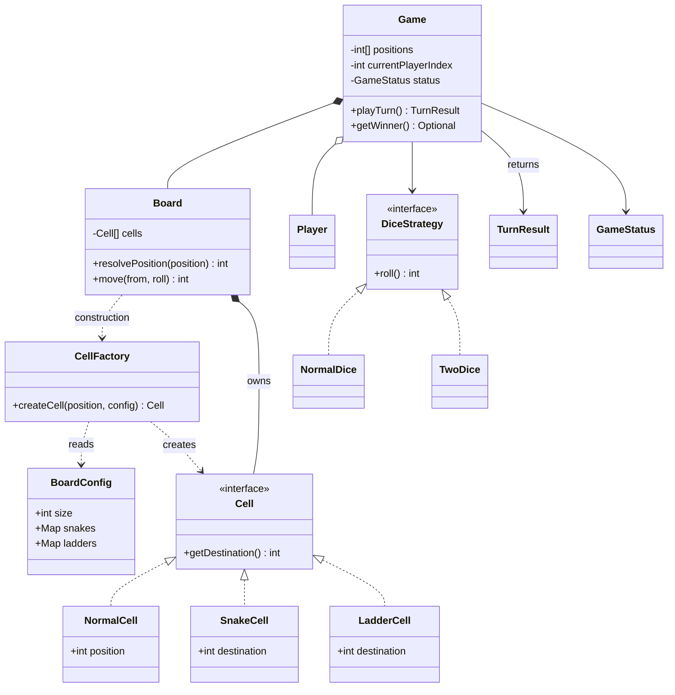
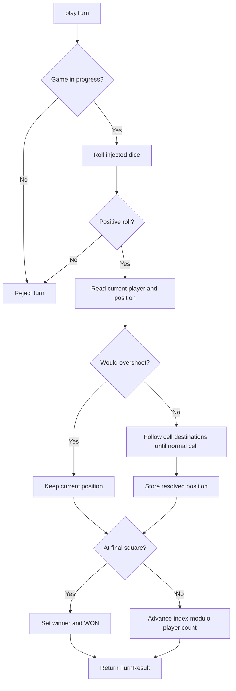
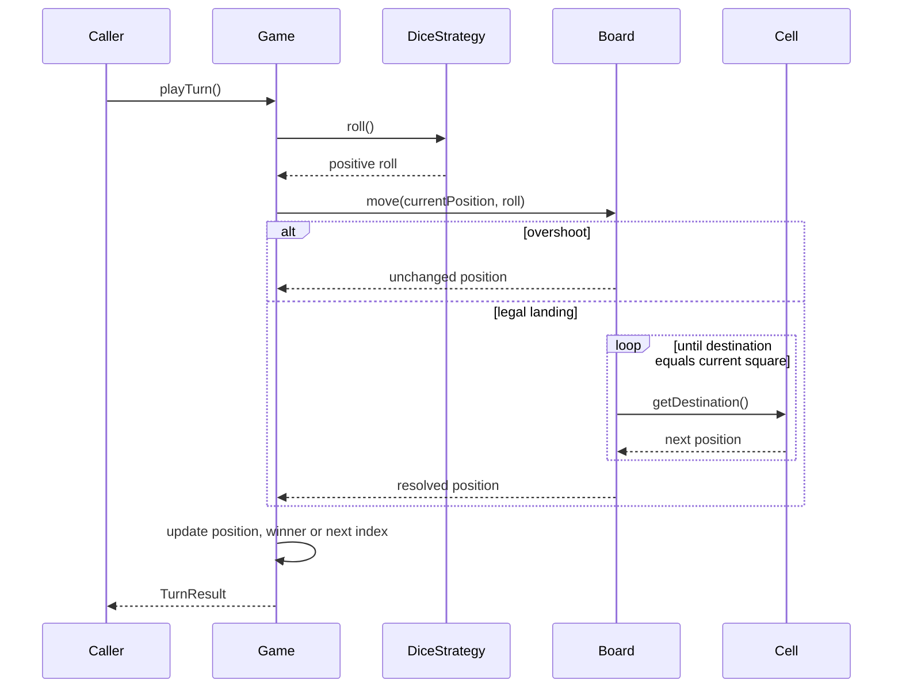

# 03. Snake and Ladder

Java 17 revision package based on our **Next LLD Snake Ladder** discussion. It keeps your final `Cell.getDestination()` model, the configuration/factory split, dice strategies, and `(index + 1) % players.size()` turn rotation.

## 1. Requirements

- Two or more distinct players take turns in fixed cyclic order. Names identify players in this example.
- Positions run from 0 (before the board) to the configured final square; all players start at 0.
- Roll one six-sided die by default; inject two dice or another `DiceStrategy` without changing the game.
- An overshoot leaves the player in place and consumes the turn. No extra turn for a six and no six required to enter.
- Follow every snake/ladder in a chain until a normal square is reached. The final square is always normal.
- The first player to reach the final square wins; reject subsequent turns.
- Reject invalid jump direction, out-of-range endpoints, shared starts, and cycles at construction.
- In-memory, single-threaded game; no persistence, network play, or undo/redo in this scope.

## 2. Core entities and responsibilities

| Type | Responsibility |
| --- | --- |
| `BoardConfig` | Immutable size and snake/ladder maps; validates individual jumps and overlapping starts |
| `CellFactory` | Creates a normal, snake, or ladder cell using the configuration |
| `Cell` | Supplies the destination of its square |
| `NormalCell` | Returns its own position |
| `SnakeCell`, `LadderCell` | Store only the destination; their start is the board index |
| `Board` | Owns cells, rejects cycles, enforces bounds/overshoot, resolves chains |
| `DiceStrategy` | Supplies a positive roll; `NormalDice` and `TwoDice` implement it |
| `Player` | Immutable player identity |
| `Game` | Owns positions, turn index, status, and winner; coordinates a turn |
| `TurnResult` | Immutable details for display without exposing mutable game state |

Positions belong to the game so the same immutable player can participate in separate games safely.

## 3. Architecture / class diagram



## 4. Complete flow

Construction: create validated `BoardConfig` → factory builds cells for 0 through size → board validates the jump graph → game copies players and initializes positions to 0.





Example: roll 2 from 0 → ladder `2 → 12` → snake `12 → 5` → ladder `5 → 18` → normal cell 18. Only the resolved position is stored. For an overshoot, `TurnResult.landing` records the unchanged square, with `overshoot = true`.

## 5. Design decisions

The board index tells us where a cell starts; the cell tells us where it goes. `NormalCell(position)` makes the original no-argument `getDestination()` interface work without adding `resolve(currentPosition)`. Snake and ladder cells do not duplicate their starting positions.

Configuration describes **what** exists, the factory decides **how** to instantiate it, and the board owns the resulting objects and movement rules. Immutable configuration maps prevent later edits from silently changing a board.

The fixed player list plus a cyclic index is simpler than removing and reinserting players in a queue. A win leaves the index on the winning player. An invalid dice result changes neither positions nor turn order.

Cycle detection traverses the destination graph during construction, marking unseen, visiting, and complete nodes. A visiting node encountered again implies a cycle. A normal cell's self-destination is a valid stopping point, not a cycle. This catches mixed ladder/snake loops such as `2 → 12 → 2`.

## 6. Patterns used

- **Strategy:** dice behavior varies behind `DiceStrategy`; tests inject deterministic rolls.
- **Simple Factory:** `CellFactory` centralizes cell creation. This is a simple factory, not the GoF Factory Method pattern.
- **Polymorphism:** movement asks every cell for a destination without branching on its concrete type.

No State or Builder pattern is needed for these requirements. An enum is enough for two game statuses.

## 7. Trade-offs and complexity

An array allocates one cell per square: O(N) construction and memory, including O(N) temporary cycle-validation state. Resolving a chain of length K takes O(K); a normal landing and player-index rotation are O(1). A sparse map would use less memory on a huge board, but the cell array directly expresses our discussion's model. Precomputing final destinations could make turns O(1) at the cost of additional stored state.

The three cell types currently return stored integers similarly. Keeping distinct types expresses the domain and supports later behavior; a single destination map would be more compact. Overshoot and turn rules are currently concrete board/game behavior; introduce rule strategies only if variations become requirements.

This implementation assumes one caller drives the game. Concurrent network commands would need turn ownership checks and atomic updates. Random games have no fixed completion bound; the demo stops after 10,000 turns and reports if nobody won.

## 8. Possible extensions

- Configuration providers for JSON, presets, or random generation, producing the same validated `BoardConfig`.
- Extra-turn, entry, or overshoot policies once alternative rules are needed.
- Move history for replay/undo, retaining the actual roll rather than rerolling.
- Observer notifications for a UI; persistence and game IDs for multiplayer sessions.

## 9. Run and checks

From the repository root with JDK 17 or newer:

```powershell
./03-snake-and-ladder/run.ps1 -TestOnly
./03-snake-and-ladder/run.ps1
```

No external dependencies. The script compiles main/test sources, runs assertion-based checks, then optionally runs the automated two-player demo. Checks cover chains, cycles, configuration errors, overshoot including integer overflow, exact and ladder-assisted wins, three-player turn rotation, invalid dice, and post-win rejection.

## 10. Interview revision notes

Explain this flow: **current player → roll → validate/overshoot → resolve chain → update position → check winner → rotate turn**.

Be ready to answer: Why an index rather than a queue? Why does the normal cell store its position? Who validates cycles? Why split configuration and creation? Where would new dice behavior go? What changes if only one jump per turn is allowed? Which state must undo restore?

The key invariant is that every configured destination chain terminates at a normal cell; every stored player position stays between 0 and the final square.
