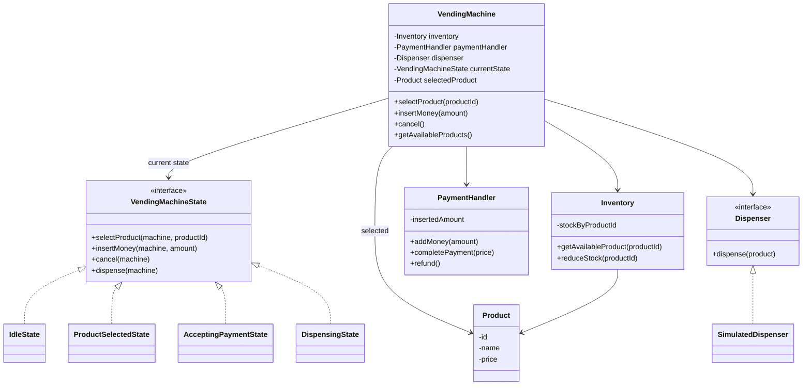

# Vending Machine — Low-Level Design (Java)

**Level:** 1–2 YOE interview practice  
**Patterns:** State (primary), Strategy via `Dispenser` interface (small extension)  
**Scope:** one physical machine, one customer transaction at a time, cash amount in whole rupees.

## Requirements

- Display available products, prices, and in-stock quantities.
- Select a product; allow changing it **before** inserting money.
- Accept multiple cash insertions and calculate remaining amount/change.
- Dispense a product once enough money has been inserted.
- Reduce inventory **only after successful dispense acknowledgement**.
- Cancel and refund before dispensing; refund if dispenser fails.
- Reject invalid operations (e.g. insert money before selection, change product after payment begins).

## Class diagram



## State transitions

```mermaid
stateDiagram-v2
    [*] --> IDLE
    IDLE --> PRODUCT_SELECTED: select in-stock product
    PRODUCT_SELECTED --> PRODUCT_SELECTED: change product
    PRODUCT_SELECTED --> ACCEPTING_PAYMENT: insert first amount
    PRODUCT_SELECTED --> IDLE: cancel
    ACCEPTING_PAYMENT --> ACCEPTING_PAYMENT: insufficient money; insert more
    ACCEPTING_PAYMENT --> DISPENSING: total paid >= price
    ACCEPTING_PAYMENT --> IDLE: cancel / refund
    DISPENSING --> IDLE: dispense succeeds / settle + change
    DISPENSING --> IDLE: dispense fails / refund
```



**Note:** if the very first inserted amount covers the price, transition directly through `ACCEPTING_PAYMENT → DISPENSING → IDLE` in one method call.

## End-to-end flow

```text
UI → VendingMachine.selectProduct(id)
   → currentState.selectProduct(machine, id)
   → Inventory.getAvailableProduct(id) [exists, quantity > 0]
   → machine stores selection → PRODUCT_SELECTED

UI → VendingMachine.insertMoney(amount)
   → currentState.insertMoney(machine, amount)
   → PaymentHandler.addMoney(amount)
   → ACCEPTING_PAYMENT (if first insertion)
   → if total < price: wait for more money
   → otherwise: DISPENSING
       → Dispenser.dispense(product)
          ├── succeeds → Inventory.reduceStock(id)
          │             → PaymentHandler.completePayment(price)
          │             → return change → IDLE
          └── fails    → PaymentHandler.refund()
                        → leave stock unchanged → IDLE
```

## Responsibilities

| Class | Responsibility |
|---|---|
| `Product` | Immutable product identity, name, price; no stock quantity |
| `Inventory` | Store quantities per product, validate stock, decrement on successful dispense |
| `PaymentHandler` | Hold inserted amount, calculate change, reset/refund balance |
| `Dispenser` | Isolate hardware dispensing and its possible failure |
| `VendingMachine` | Own machine session and coordinate inventory, payment, dispenser, transitions |
| `VendingMachineState` implementations | Permit/reject operations and initiate appropriate transitions |
| `Main` | Show successful sale, cancellation, and simulated failure |

## Design decisions / trade-offs

1. **State pattern rather than repeated state checks:** each state permits only appropriate operations. Invalid operations fail fast via interface default methods.
2. **Keep states thin:** states call `VendingMachine` helpers; they don't own Inventory or PaymentHandler dependencies.
3. **Product vs inventory:** `Product` does not store quantity; the machine's `Inventory` does.
4. **Separate dispenser:** mechanical behavior can fail or be swapped without coupling hardware to accounting.
5. **Stock update after acknowledged dispense:** appropriate for this synchronous one-customer exercise. Real hardware might provide uncertain/late acknowledgements, requiring fault reconciliation.
6. **Cancellation:** allowed in `PRODUCT_SELECTED` and `ACCEPTING_PAYMENT`; blocked in `DISPENSING`.
7. **No `Display` domain class:** a UI can render `getAvailableProducts()` and show selected price; UI implementation is out of scope.
8. **Simplifications:** one active customer, no card processor, no denomination/coin inventory or change shortage, no timeouts, no persistence, no admin panel.
9. **Multiple users extension:** use atomic reservation (physical − reserved = available), an expiry time, and concurrency control; do not add this to the base design.
10. **Money representation:** this example uses whole-rupee `int` values. A real implementation uses minor units (`long` paise) or an explicit Money type.

## Run

Requires Java 11+.

```bash
cd VendingMachine
mkdir -p out
javac -d out src/main/java/vendingmachine/*.java src/test/java/vendingmachine/*.java
java -cp out vendingmachine.Main
java -cp out vendingmachine.VendingMachineTest
```

## Interview revision notes

- **Pattern identification:** behavior differs by current state → State pattern.
- **Context:** `VendingMachine` owns currentState and dispatches operations to it.
- **Transition responsibility:** states decide *when*; machine helpers perform *what* and coordinate dependencies.
- **Consistency:** dispense success first, then decrease stock and settle payment; failure leaves stock intact and refunds.
- **SRP:** don't ask `Dispenser` to update inventory or refund customers.
- **Common follow-up:** if two customers can buy simultaneously, add reservations and atomic/locked stock updates.
- **Interview caution:** don't claim payment is truly reversible after physical dispensing; hardware failures require special handling in production.
